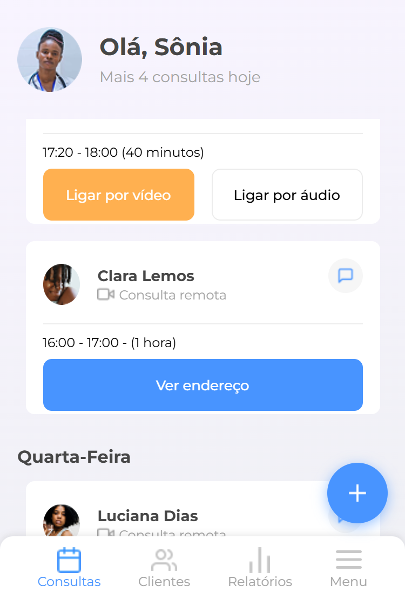
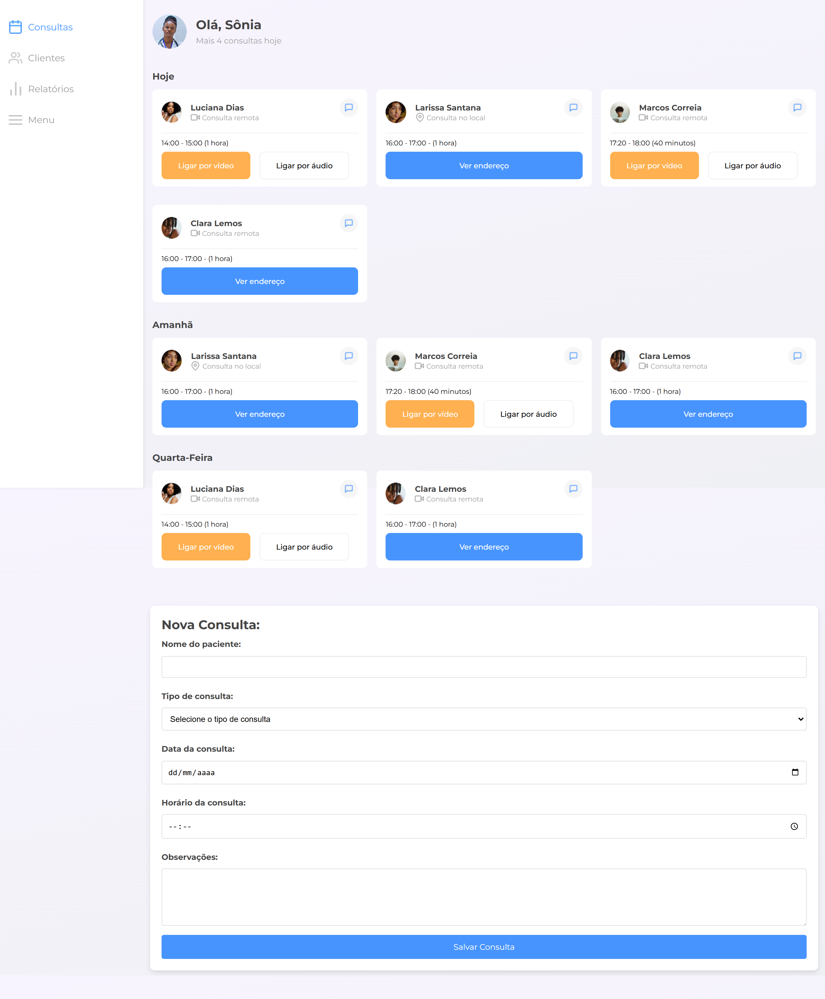
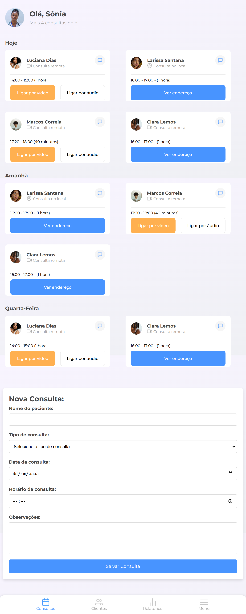

# Meu Projeto - Controle de Consultas

Este projeto consiste em uma página **responsiva** para que médicos possam gerenciar consultas agendadas. O desenvolvimento foi feito com a abordagem **mobile first**.

## 🌐 Versões do Site

Aqui estão as versões do site em diferentes dispositivos:

### 📱 **Versão Mobile**

### 💻 **Versão Desktop**

### 🖥️ **Versão Tablet**

## 🌐 Acesse o site
Confira o site [aqui](https://mateuspistillo.github.io/Aluramed/).
